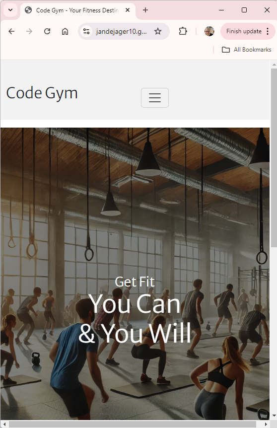
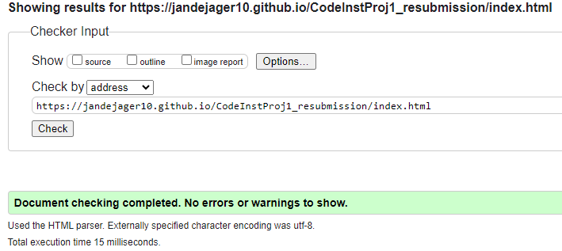
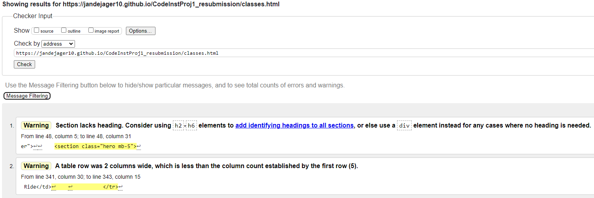
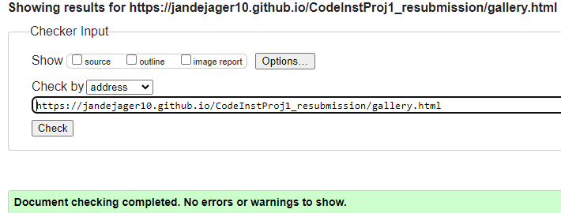
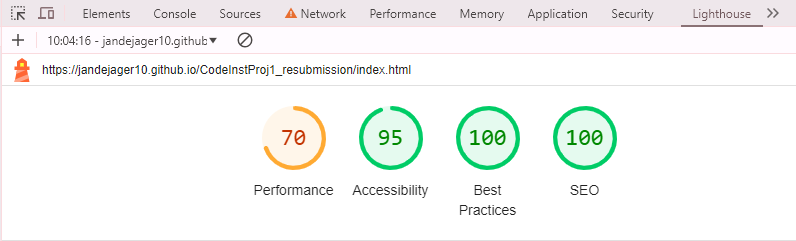
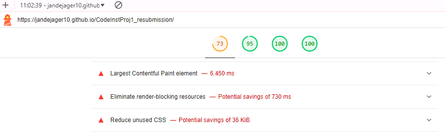
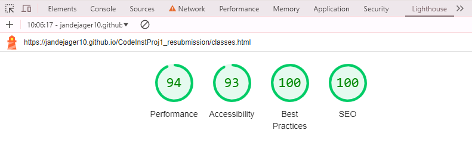

# CodeInstProj1_resubmission
Resubmission of Milestone Project 1

# Code Gym Website

Mockup with [amiresponsive](https://ui.dev/amiresponsive)

## Project Overview

The **Code Gym Website** is a static front-end site created to showcase the facilities, classes, and amenities offered by Code Gym. Built using HTML5 and CSS3, the site is designed to attract new members while providing current members with essential information about schedules, trainers, and services. This documentation outlines the project’s structure, design decisions, and value to its users.

## Table of Contents

1.  [Project Purpose and Value](#project-purpose-and-value)
2.  [Design Decisions](#design-decisions)
3.  [File Structure](#file-structure)
4.  [Optimization Techniques](#optimization-techniques)
5.  [Testing and Accessibility and Code Validation](#testing-and-accessibility-and-code-validation)
6.  [Future Expansion](#future-expansion)
7.  [Deployment and Version Control](#deployment-and-version-control)
8.  [Attribution](#attribution)
9.  [Technologies Used](#Technologies-Used)

## Project Purpose and Value

This website offers potential and current gym members a streamlined, engaging platform to explore Code Gym’s services. Visitors can view the gym’s schedule, explore facilities, and find details on personal training, membership options, and more. The design and layout prioritize user experience, ensuring visitors can quickly find information and get inspired to join.

## Design Decisions

### Visual Hierarchy and User Experience

- **Hero Section**: A high-impact hero section featuring a motivating message and a background image of the gym welcomes users to the homepage. This section sets the tone of the website as an energetic, welcoming space.
- **Navigation and Page Layout**: Each page has a consistent layout and navigation, making it easy to access all key areas (Classes, Gallery, Contact). The navigation links are responsive and transform into a mobile-friendly hamburger menu on smaller screens.
- **Color Scheme and Font Choices**: The color palette reflects the brand, with high-contrast choices that are both appealing and accessible. Typography combines the Merriweather Sans and Lato fonts for readability and a modern look.

### Page-Specific Layouts

- **Home Page (`index.html`)**: Highlights the gym’s core message and introduces the gym’s facilities with visually engaging content and a “Learn More” button to expand additional details on various services.
- **Classes Page (`classes.html`)**: Provides users with an interactive timetable for various classes. Users can view class timings, trainers, and other relevant information in a tabular format.
- **Gallery Page (`gallery.html`)**: Displays images of the gym’s facilities, trainers, and classes in a consistent grid layout, creating a visual showcase of the gym environment.
- **Contact Page (`contact.html`)**: Offers contact details and an embedded contact form for inquiries, with form validation for a smooth user experience.
- **404 Page (`404.html`)**: A custom error page that provides a friendly message and guidance back to the homepage, enhancing the experience for users who encounter a broken link.

## File Structure

The project files are organized as follows to ensure clarity and ease of management:

`main_folder/├── index.html # Home page├── classes.html # Classes page├── contact.html # Contact page├── gallery.html # Gallery page├── 404.html # Custom 404 error page├── README.md # Project documentation├── assets/ # Folder for assets│ ├── css/ # Folder for CSS files│ │ └── style.css # Main stylesheet│ ├── images/ # Folder for images│ │ ├── hero-banner.webp # Hero image│ │ ├── facility1.webp # Facility image│ │ ├── instructor1.webp # Instructor images│ │ ├── instructor2.webp│ │ ├── instructor3.webp│ │ ├── instructor4.webp│ │ ├── gymimage1.webp│ │ ├── equipment1.webp│ │ ├── activity1.webp│ │ └── cardio1.webp│ └── favicon.ico # Favicon for the website`

- **CSS Files**: All CSS files are stored in the `assets/css/` folder, with `style.css` as the main stylesheet for the site’s custom styles.
- **Images**: Images are organized in `assets/images/` and include optimized `.webp` images to ensure high quality and quick loading times.

## Optimization Techniques

To improve page load times and reduce the Largest Contentful Paint (LCP) for a smooth user experience, several optimization techniques were applied:

- **Lazy Loading for Images**: Non-critical images are set to lazy-load, reducing initial load time and bandwidth usage.
- **Preconnect and Prefetch Hints**: To reduce load times, `preconnect` and `dns-prefetch` hints were used for external resources like Bootstrap and FontAwesome, allowing the browser to connect to external servers in advance.
- **Minimizing Render-Blocking Resources**: JavaScript files are loaded asynchronously or deferred where possible to prevent render-blocking.

## Testing and Accessibility and Code Validation

### Testing Procedures

The website has been tested for functionality, usability, and cross-browser compatibility on multiple devices:

1.  **Responsive Design**: Verified on various screen sizes, including mobile, tablet, and desktop, ensuring consistent navigation and readability.
2.  **Browser Compatibility**: Tested on Chrome, Firefox, Safari, and Edge.
3.  **Form Validation**: The contact form includes HTML5 validation to ensure correct data entry before submission.
4.  **CSS and HTML Validation**: All CSS and HTML code were validated using the official W3C and Jigsaw validators.

**Testing Tools:**

* Manual testing will be conducted using various web browsers on different devices (desktop, mobile) to ensure cross-browser compatibility.

## Testing Documentation
Manual testing was performed across multiple devices (desktop, mobile) and web browsers (Chrome, Firefox, Safari). The following test cases were verified:

**1. Functionality:**

| Test Case ID | Description | Expected Result | Pass/Fail | Comments |
|---|---|---|---|---|
| TC-01 | Access the home page (index.html) | The home page should load successfully and display the gym's name ("Code Gym"). | Pass | Passes after correcting 404.html page name. |
| TC-02 | Navigate to the "Classes" page (classes.html)  | Clicking the "Classes" navigation link should lead to the classes page. | Pass | Confirm navigation functionality between pages. |
| TC-03 | Navigate to the "Contact" page (contact.html) | Clicking the "Contact" navigation link should lead to the contact page. | Pass | Confirm navigation functionality between pages. |
| TC-04 | Navigate to the "Gallery" page (gallery.html) | Clicking the "Gallery" navigation link should lead to the gallery page. | Pass | Confirm navigation functionality between pages. |
| TC-05 | Submit a contact form | Filling and submitting the contact form should successfully submit the data (without actual functionality of sending emails). | Pass | Works and posts form to CodeInst page. |
| TC-06 | Test broken links | Clicking a broken link should display a user-friendly error page (error.html). | Pass | Works and show error page after correcting file name. |

Screenshots from testing:

**2. User Experience:**

| Test Case ID | Description | Expected Result | Pass/Fail | Comments |
|---|---|---|---|---|
| TC-07 | Mobile Responsiveness | The website should display correctly and be usable across various screen sizes (desktop, mobile). | Pass  | initial slow load due to large images. |
| TC-08 | Page Loading Speed | Pages should load reasonably fast for a good user experience. | Pass  | initial slow load due to large images (subjective assessment). |
| TC-09 | Clear Navigation | The navigation menu should be clear and easy to understand, allowing users to find desired information efficiently. | Pass | Easy and clear navigation. |
| TC-10 | Image Quality | Images used throughout the website should be high-resolution and visually appealing. | Pass |  Subjective assessment of image quality and relevance. |

### Accessibility

The website follows accessibility guidelines, including:

- **Color Contrast**: High contrast between background and foreground colors ensures readability.
- **Semantic Markup**: Semantic HTML tags are used throughout to ensure screen reader compatibility.
- **Alternative Text for Images**: All images include descriptive alt text to support visually impaired users.
- **Keyboard Navigation**: Ensured that interactive elements like buttons and links are accessible via keyboard navigation.

## Code Validation

This website's HTML and CSS code were validated using the following tools to ensure compliance.

### HTML Validation
The HTML code was validated using the [W3C Markup Validation Service](https://validator.w3.org/). All pages passed with no errors.

**Proof of validation**:

### CSS Validation
The CSS code was validated using the [W3C CSS Validation Service (Jigsaw)](https://jigsaw.w3.org/css-validator/). The stylesheet passed with no errors or warnings.

**Proof of validation**:

### Lighthouse
Page load times initially quite slow because of images sizes:

  Page load after corrective actions - image is simply to large.
    

**Correction Actions**
Added preconnect and dns-prefect to the required origin sites
Defering image loads on home page
Performance has increased
    Other than replacing the images or creating seperate java pages for the scripts (currently inline) there does not seem a way to increase performance on initial load.

**Pass/Fail Criteria:**

* All test cases must pass for a successful website launch.
* Any critical bugs or usability issues discovered during testing will require rectification before deployment.
* Minor visual inconsistencies can be addressed after launch based on priority.

Minor layout inconsistencies or visual adjustments will be documented for future updates.

Testing Tools:
Web Browsers (Chrome, Firefox, Safari)
Mobile Devices (phones, tablets)
Testing notes and documentation (screenshots, bug reports)

## Future Expansion

Potential features for future releases include:

- **Booking System**: A class booking system allowing members to reserve spots in classes directly through the site.
- **Interactive Scheduler**: Integration of an interactive scheduler for users to explore class timings and availability.
- **Member Login Portal**: A secure login area where members can manage their profiles, track attendance, and view personal training sessions.

## Deployment and Version Control

The project is version-controlled using Git and hosted on GitHub. Deployment steps:

1.  **Version Control**: All code changes are tracked using Git, with meaningful commit messages documenting the development process.
2.  **Deployment**: The site is hosted on GitHub Pages, allowing easy access and updates.

### Deployment URL

[Link to deployed site on GitHub Pages](https://jandejager10.github.io/CodeInstProj1_resubmission/index.html)

## Attribution
- Bootstrap CSS framework (used for grid layout) also because I can't figure out hamburger button without: [Bootstrap Documentation](https://getbootstrap.com/docs/5.3/getting-started/introduction/)
- FontAwesome icons (used for icons like phone and email): [FontAwesome Documentation](https://fontawesome.com/)
- Hover.css (used for hover effects): [Hover.css Documentation](http://ianlunn.github.io/Hover/)
- chatgpt.com (used for image creation): [Image creator DALL.E](https://chatgpt.com/)
- JavaScript: [Event Listener](https://www.w3schools.com/js)

All other code is custom-written.

## Technologies Used
- HTML5
- CSS3
- Bootstrap (for responsive layout)
- JavaScript (https://www.w3schools.com/js the only way I could get the Learn More button to work)